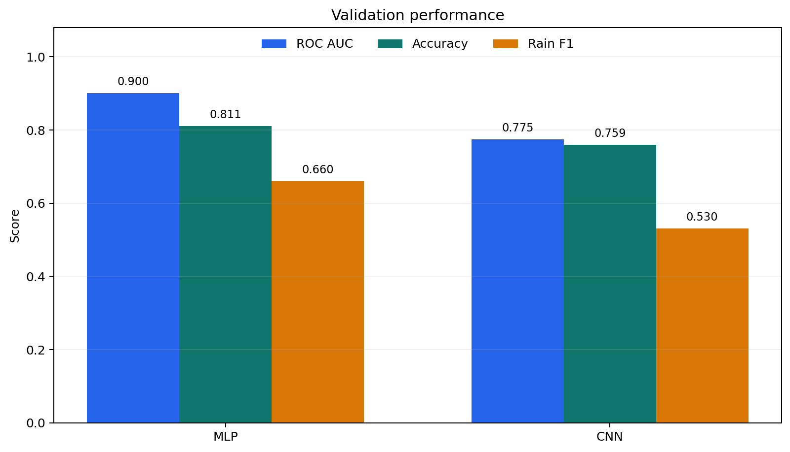
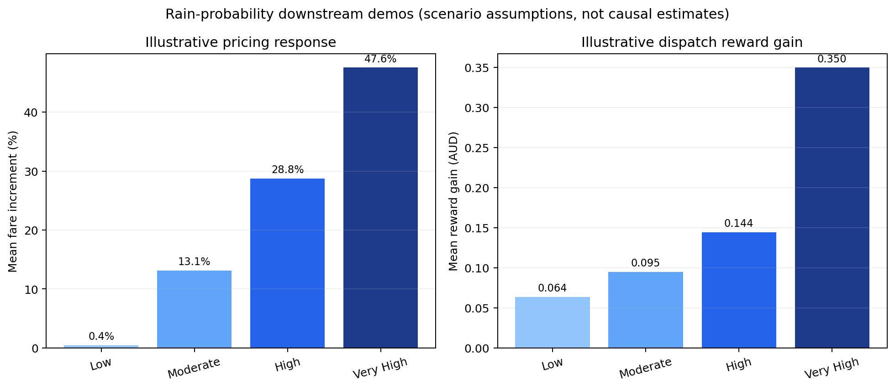

# RainTomorrow: Australian Rainfall Prediction

A reproducible PyTorch pipeline for predicting whether it will rain tomorrow from the Australian `weatherAUS` tabular dataset. The repository covers preprocessing, model training, validation, batch inference, and two small downstream decision demos.


## Results at a glance



| Model | ROC AUC | Accuracy | Rain precision | Rain recall | Rain F1 |
|---|---:|---:|---:|---:|---:|
| MLP | **0.900** | **0.811** | **0.552** | **0.822** | **0.660** |
| 1D CNN | 0.775 | 0.759 | 0.471 | 0.606 | 0.530 |

The MLP is the stronger result in this experiment. Accuracy alone is insufficient because rainy days are the minority class; ROC AUC and rain-class precision/recall should be read together.

## What is included

- Median imputation and standardisation for numeric variables.
- Mode imputation and one-hot encoding for categorical variables.
- Stratified train/validation split, with preprocessing fitted only on training data.
- Four PyTorch model options: logistic baseline, MLP, wide MLP, and 1D CNN.
- Positive-class weighting, early stopping, reproducible random seed, evaluation, and CSV inference.
- Illustrative taxi pricing and dispatch simulations that consume predicted rain probabilities.

## Project structure

```text
.
├── data.py                    # data loading and leakage-safe preprocessing
├── model.py                   # PyTorch model registry
├── train.py                   # training and artifact export
├── evaluate.py                # checkpoint evaluation
├── predict.py                 # batch inference
├── taxi_pricing_demo.py       # downstream pricing scenario
├── taxi_dispatch_demo.py      # downstream dispatch scenario
├── scripts/
│   └── make_readme_figures.py
├── assets/                    # README figures
└── outputs/                   # metrics and generated demo reports
```

## Quick start

```bash
git clone https://github.com/fujiadong8-max/rainfall-prediction.git
cd rainfall-prediction
python -m venv .venv
```

Activate the environment, then install dependencies:

```bash
pip install -r requirements.txt
```

Download `weatherAUS.csv` from [the public **Rain in Australia** dataset page on Kaggle and place it in the repository root. The dataset is intentionally excluded from Git so that its original source and terms remain explicit.
](https://www.kaggle.com/datasets/mohamedmahmoud153/weatheraus)
Train the recommended MLP:

```bash
python train.py --model mlp --epochs 100 --batch-size 256
```

Evaluate a checkpoint:

```bash
python evaluate.py \
  --checkpoint outputs/mlp_model.pt \
  --csv-path weatherAUS.csv \
  --save-metrics outputs/mlp_eval.json
```

Run batch inference:

```bash
python predict.py \
  --checkpoint outputs/mlp_model.pt \
  --csv-path weatherAUS.csv \
  --output outputs/mlp_predictions.csv
```

The prediction file appends:

- `RainTomorrow_probability`
- `RainTomorrow_pred` (`0` or `1`)
- `RainTomorrow_pred_label` (`No` or `Yes`)

## Downstream examples

The repository includes scenario-based examples showing how a rain probability could enter pricing and dispatch rules.



```bash
python taxi_pricing_demo.py --predictions outputs/mlp_predictions.csv
python taxi_dispatch_demo.py --predictions outputs/mlp_predictions.csv
```

These outputs are synthetic decision analyses. Their fare and reward changes depend on hand-set assumptions and are **not** empirical estimates of business impact.

## Reproduce the README figures

The committed figures are generated from JSON summaries in `outputs/`:

```bash
pip install matplotlib
python scripts/make_readme_figures.py
```

## Methodological limits

- A random holdout can leak location- and era-specific structure across splits; a stronger study should use temporal and location-held-out evaluation.
- Threshold `0.5` is not optimised for a deployment loss function, and probability calibration is not assessed.
- The current comparison reports a single seed and no uncertainty intervals or external validation.
- Missingness may itself encode station or collection processes; median/mode imputation does not resolve that bias.
- The CNN treats transformed tabular features as an ordered sequence, although that ordering has no natural spatial meaning; its result should be regarded as an architectural comparison, not evidence of convolutional structure.

## Data and artifact policy

The raw dataset, trained weights, preprocessors, and large prediction files are ignored. This keeps the repository lightweight and avoids redistributing third-party data. Compact metric summaries and demonstration reports are retained for transparency.

## License

No open-source licence has been assigned. The code is provided for inspection and portfolio demonstration; reuse requires permission from the repository owner. The dataset remains subject to its source terms.
